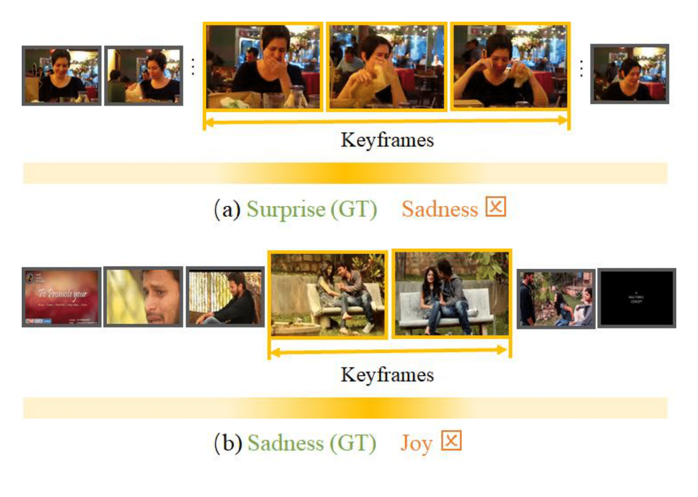

<div align="center">

# Weakly Supervised Video Emotion Detection and Prediction via Cross-Modal Temporal Erasing Network


<i>Zhicheng Zhang, Lijuan Wang, and Jufeng Yang</i>

<a href=" "></a>
[](https://cvpr2023.thecvf.com/)
[](./LICENSE)

</div>

This is the official implementation of our **CVPR 2023** paper. [[PDF]]()

## Summary of this work


Automatically predicting the emotions of user-generated videos (UGVs) receives increasing interest recently. However, existing methods mainly focus on a few key visual frames, which may limit their capacity to encode the context that depicts the intended emotions. To tackle that, in this paper, we propose a cross-modal temporal erasing network that locates not only keyframes but also context and audio-related information in a weakly-supervised manner. In specific, we first leverage the intra- and inter-modal relationship among different segments to accurately select keyframes. Then, we iteratively erase keyframes to encourage the model to concentrate on the contexts that include complementary information. Extensive experiments on three challenging benchmark datasets demonstrate that the proposed method performs favorably against the state-of-the-art approaches.


 


## Running

You can easily train and evaluate the model by running the script below.

You can adjust more details such as epoch, batch size, etc. Please refer to [`opts.py`](./opts.py).

~~~~
$ bash run.sh
~~~~

The used datasets are provided in our [homepage](https://cv.nankai.edu.cn/).

## Citation

If you find this repo useful in your project or research, please consider citing the relevant publication.

````
@inproceedings{zhang2023ECL,
  title={Weakly Supervised Video Emotion Detection and Prediction via Cross-Modal Temporal Erasing Network},
  author={Zhang, Zhicheng, Wang,Lijuan and Yang, Jufeng},
  booktitle={Proceedings of the IEEE/CVF Conference on Computer Vision and Pattern Recognition (CVPR)},
  year={2023}
}
````